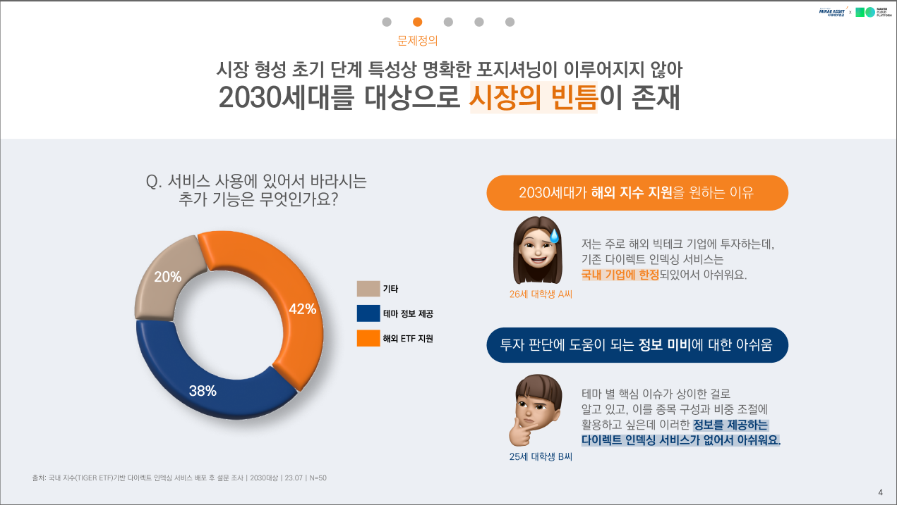
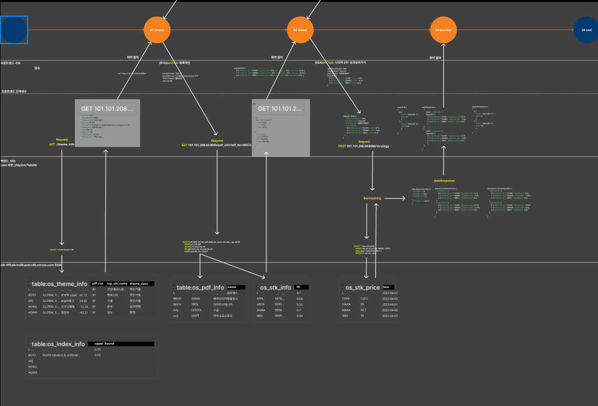
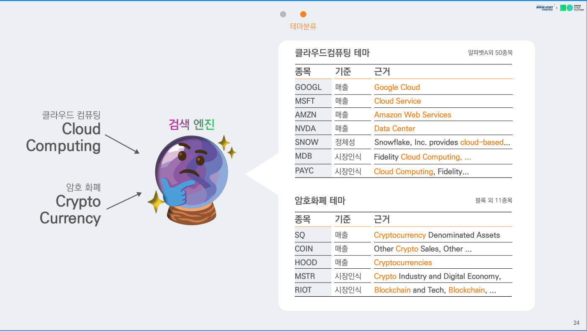
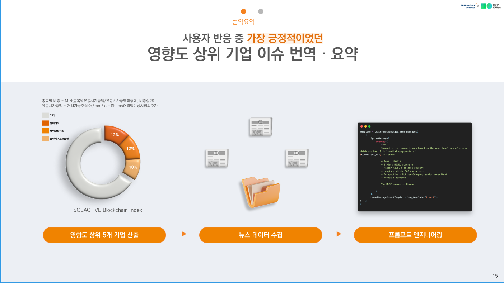
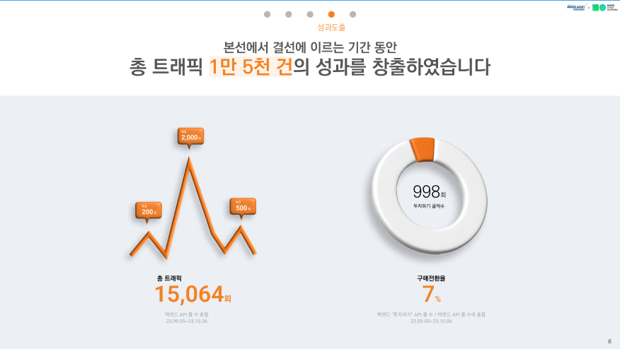
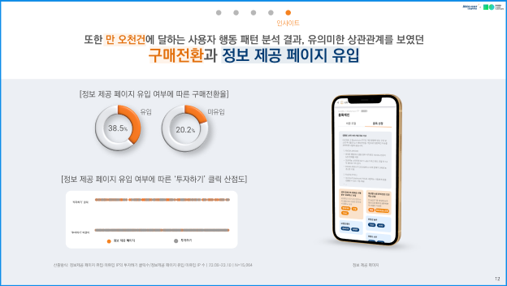
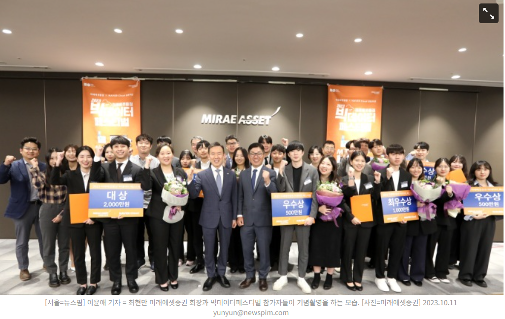

# 미래에셋증권x네이버클라우드플랫폼 빅데이터 페스티벌

*프로젝트 수행 이력: 2023.07.01 ~ 2022.10.10*

*2024.01.28 포트폴리오 목적으로  Readme 작성 후 업로드: 조문근*

- [미래에셋증권x네이버클라우드플랫폼 빅데이터 페스티벌](#------x--------------------)
  * [Abstract](#abstract)
  * [1 개요](#1---)
    + [1.1 기대되는 성과](#11--------)
    + [1.2 예상되는 리스크와 대응방안](#12---------------)
  * [2 주된 의사결정 요약](#2-----------)
  * [3 아키텍처 설계](#3--------)
  * [4 미국 주식 공시 데이터 수집 및 가공 후 테마 분류 자동화](#4---------------------------------)
    + [4.1 OpenAI text-davinci-003을 **사용한 기업 테마 토픽 모델링**](#41-openai-text-davinci-003----------------------)
  * [5 테마 구성종목들의 영향도 상위 종목 뉴스 번역 및 요약 자동화](#5-----------------------------------)
  * [6 결과](#6---)
    + [6.1 사업의 주된 성과](#61----------)
    + [6.2 대회의 주된 성과](#62----------)
  * [Reference](#reference)

## Abstract

본 프로젝트는 총 인원 3명, 기간 3달, 월별 보고서 제출이 요구되며 제출한 보고서 및 개발 산출물을 바탕으로 예선, 본선, 결선에 진출하여 발표하는 형식이었음. 프로젝트 시작 전, 팀원들과 비즈니스 적인 측면을 강조하자고 의견을 모았고, 이에 따라 시간 적인 제약을 고려하여 기술의 정밀도를 추구하기 보다는 서비스의 전체적인 완성 및 비즈니스 임팩트의 검증을 우선으로 두고 진행하였음. 또한 기초 지수 Methology 및 백테스팅의 구현 사항은 개발기획서 및 본선 보고서에 구체적으로 포함 되어있어, 본 문서에 포함하지 않았음.

## 1 개요

다이렉트 인덱싱이란 투자자 개인이 직접 ETF를 구성하고 이에 투자까지 해주는 서비스이다. 이에 따라, 기존 ETF에서 해결해주지 못했던 1) 비중 조절에 따른 세금 최적화 2) 개인 선호에 따른 종목 구성 등의 이점이 있음. 국내에서는 KB증권, NH투자증권과 스타트업 중심으로 이제 막 도입이 시작되는 현황임. 가장 눈에 띄는 경쟁사는 KB증권으로써, 프로젝트를 진행 당시 국내 주식 대상으로만 다이렉트 인덱싱을 진행하는 상황이었음.

### 1.1 기대되는 성과

▶ **실제 비즈니스 성과에 직결되는 LLM 기술 활용**

23년도 초에 OPEN AI로부터 LLM의 대중화가 이루어졌음. 이에 따라 많은 기업에서도 LLM을 비즈니스 차원에서 활용해보려는 시도가 이루어지고 있음. 본 대회의 목적도 LLM을 활용한 투자 서비스 발굴인 것이 그 예시임. 이에, 실제로 LLM을 활용한 비즈니스를 수행하고 성과를 측정하는 경험을 통해 향후 LLM 활용 프로젝트에 기반을 다질 수 있음.

**▶ 전반적인 서빙 파이프라인 및 협업에 대한 경험**

비즈니스 임팩트의 검증, 즉 실제 트래픽까지 창출해내야 한다는 점에서 단순 모델링 뿐만 아니라 컴퓨터 지식을 총 동원해서 서빙까지 수행해야함. 이에 따라 아키텍쳐 및 설계 상황에서 1) 언제 어떤 기술이 무슨 이유로 요구되는가 등의 엔지니어링 역량, 2) 디자인-프론트엔드-백엔드 인원의 커뮤니케이션 역량의 향상이 기대됨.

### 1.2 예상되는 리스크와 대응방안

**▶ 기술보단 비즈니스를 우선했다는 점에서 기술적인 세부 사항에 대한 고려 미비**

서비스의 전반적인 완성과 비즈니스 임팩트 검증을 우선으로 한다는 목표에 따라 1) 실제 서빙 후 트래픽까지 측정해야 한다는 점 2) 제한 시간이 3달인점을 고려하여 완벽보다는 완성을 우선해야한다고 판단했음. 이에 따라, 활용한 기술에 대한 세부 사항이 미비할 우려가 있음. 이에 따라 대회 완료 이후에 각자 맡은 업무 세부사항에 대한 정리 및 피드백이 필요함.

**▶ 사업에 대한 국내 벤치마크 데이터가 매우 희박함.**

23년도에 주로 도입이 되었던 서비스이니 만큼, 국내에 참조할 수 있는 실제 서비스에 대한 데이터가 매우 부족함. 이에 따라, 다양한 시행착오가 예상됨. 특정 목적을 최대한 간단하게 달성할 수 있는 방법을 총동원하여 리소스를 효율적으로 사용할 수 있는 방안에 대한 고려가 필요함.

## 2 주된 의사결정 요약

**▶ Streamlit MVP 배포 후 설문을 통한 근거 마련**

예선 기간 동안 Streamlit을 통해 MVP 개발 후 배포, 이후 소속 동아리 및 본교 재학생들에게 사용 권유 후 Google Form을 이용한 추가 기능 만족도 설문 진행하였음. 그 결과, 2030 중심으로 해외지수 지원(42%)과 정보 불균형 해소(38%)에 대한 수요가 존재함을 확인하였음. 

이에 근거하여, 1) 해외 주식 지원 2) LLM의 요약 및 번역 기능을 사용하여 해외 테마 정보 제공으로 당 서비스를 차별화하는 것이 적절하다고 판단함.

## 3 아키텍처 설계

개발 시간은 사전에 설계가 잘 되어있을 수록 단축된다는 것은 자명함. 이에 따라, 예선 기간(23.07~23.08)에는 아키텍처와 API 통신 및 디자인, UX에 대한 세부사항까지 사전에 설계하는 것에 주력하였음. 총 서버는 5대이며, 벡엔드 서버, AI 서버, DB서버, 프론트 서버, 이미지 CDN 서버로 구성됨. 아래는 해당 기간에 작성한 Figma를 사용한 설계도임. 최상단은 프론트이며, 최하단은 DB서버임. 좌측에서 우측으로 갈수록 사용자 경험이 진행되는 구조임. 해당 단계에서 API 별로 수신/송신된 데이터에 처리를 백엔드 혹은 프론트엔드에서 할지 여부를 결정하였음.

대회 참여에 네이버 클라우드 크레딧이 주어졌기 때문에 네이버 클라우드 플랫폼으로 서빙을 진행하였음.

## 4 미국 주식 공시 데이터 수집 및 가공 후 테마 분류 자동화

투자자들에게 기준이 되는 지수를 제공하려면 개별 주식에 테마 분류 기술이 필요함. 개별 주식의 테마 여부 판단은 그 근거에 따라 결과가 달라지는 특성을 가지고 있음. 예를 들어, AMAZON 같은 경우 산업의 분류를 판단근거로 볼 떄 유통 기업이며, 매출 구성 항목을 판단 근거로 볼때 유통과 클라우드 기업임. 이에 따라, 각각의 판단 근거를 가지는 모델을 따로 두어 OR 앙상블하는 것이 적절하다고 판단함. 

### 4.1 OpenAI text-davinci-003을 **사용한 기업 테마 토픽 모델링**

1) 미세 조정 등의 학습 설계 및 리서치, 수행에 드는 인적 리소스 2) 범용 언어 모델의 신뢰성 및 효율성 3) 추론에 소모되는 비용을 고려하여 직접 학습 보단 API 사용, GPT-3.5보다는 OpenAI의 text-davinci 모델을 선택하였음. 추가적인 학습은 시간 및 비용 이슈로 고려하지 않았음.

▶ **모델링**

개별 주식의 테마 인식에 따른 자체적인 설문조사를 기반으로, 3종류의 데이터를 사용하여 소속 테마를 예측하는 모델 3개를 앙상블하였음. 각각의 모델은 1) 시장 인식(소속 ETF 이름) 2) IR (Business Overview, 10-K) 3) 매출 구성 품목(Revenue Segment, 10-K) 데이터를 사용하여, 하나의 테마 키워드와의 코사인 유사도를 측정하는 방식을 사용하였음. 예를 들어, 매출 구성 항목에 “Electric Vehicle”이 있다면 “Electric Automobile”과의 유사도가 높게 측정되는 방식임. 각각의 유사도에 sigmoid + threshold을 설정하여 소속 테마 여부를 이진 분류하게 설정하였음. 

▶ **데이터 수집 및 전처리** 

매출 구성 품목의 경우 ****SEC-Edgar API를 사용하여 정기 및 분기 보고서를 크롤링, XBRL 문서 포맷의 US-GAAP에 기반하여 제품 및 서비스 별 매출 데이터 추출하였음. 소속 ETF 이름은 Financial Modeling Prep API, Business Overview는 yfinance API를 사용하였음. 전처리의 경우 매출 데이터는 사업 보고서 특성상 이미 정제된 데이터이므로 고려하지 않았고, 소속 ETF 이름은 ETF 브랜드 및 기타 불용어들을 필터링 하였음. Business Overview의 경우 사업 보고서 특성상 첫 문장에 회사가 인식하는 자체적인 산업의 바운더리가 명시되어있는 경우가 대부분이라 문장 그대로 사용하였음. 각각의 데이터는 출처에서 자동적으로 업데이트되기 때문에, 주기적으로 데이터만 갱신하면 실시간성이 반영됨.

입력은 테마 단어이며, 출력은 각각의 데이터에 다른 코사인 유사도의 sigmoid + threshold 충족 여부임.  

## 5 테마 구성종목들의 영향도 상위 종목 뉴스 번역 및 요약 자동화

영향도는 테마 종목들에 대한 영향도는 특정 시점이후의 수익률*시가총액에 대한 데이터에 PCA로 추출하였음. 해당 과정 이후 유사한 지수에 대한 비중 구성을 동일하게 재현함을 확인함. 해당 영향도의 상위 5개 기업에대한 연관 뉴스는 yfinance API를 사용하였고, Langchain을 사용하여 페로소나를 부여, Few-shot learning등으로 프롬프트 엔지니어링하였음. 모델링과 마찬가지로 주기별 뉴스데이터 갱신을 통해 자동으로 실시간성이 반영됨.

## 6 결과

### 6.1 사업의 주된 성과

**▶ 4주 동안 총 트래픽 15,000건, 구매전환 7% 달성**

측정은 웹서버의 자체 로그.txt에서 크롤러 등을 제외한 국내 트래픽만 선정하였음.

구매전환은 총 트래픽 대비 UX의 마지막 페이지의 “투자하기” 버튼 클릭률을 측정하였음. 실제 투자로 이어지진 않는 다는 점에서 오차를 감안해야함. 1) 일반적인 웹 쇼핑몰의 평균적인 구매전환이 2%였다는 점 2) 유입을 의도한 마케팅을 주식 커뮤니티에서 했다는 점을 고려했을 때, 어느정도 리텐션이 보장된 고객들이 유입됬으며, 이에따라 발생한 높은 구매전환이라고 판단됨.

**▶ LLM을 활용한 정보 제공의 유의미성 도출**

LLM을 활용한 정보제공 페이지 유입율과 구매전환율간의 상관관계 분석을 실시함. p_value < 0.05로 유의미함을 검증하였음.

### 6.2 대회의 주된 성과

**▶ 우수상 수상**

졸지에 센터에서 기념촬영하였음. 회장님 옆옆 우수상 팻말들고 있는 얼굴 허연놈이 본인임. 🫣 대상 탄 친구들은 발표를 엄청 잘했음 ㅎㅎ 👏

## Reference

**▶ 미국 주식 데이터에 대한 유사도 검색의 아이디어 도출**

[1] Patrick Lewis et al., “Retrieval-Augmented Generation for Knowledge-Intensive NLP Tasks(RAG)”, NIPS 2020 

[2] M. Grootendorst, BERTopic: Neural topic modeling with a class-based TF-IDF precedure , arXiv preprint arXiv:2203.05794, 2022

**▶ ︎ 뉴스 번역 및 요약에 대한 방법론**

[1] Tom B. Brown et al., “Language Models are Few-shot Learners”, NIPS 2020
